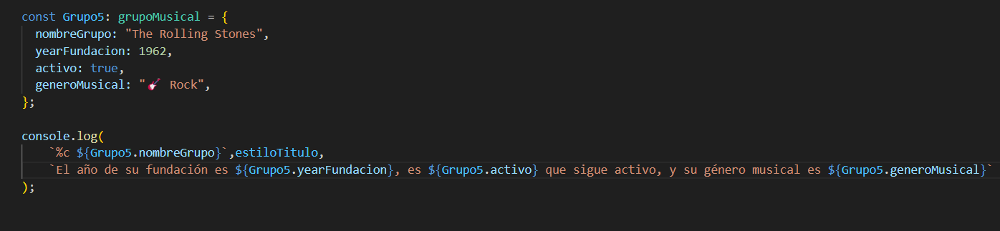

# Grupos musicales

## Interface
Creamos una interface llamada grupo músical, para asignar un tipo de valor a cada variable que posteriormente necesitamos usar para crear los grupos.

## Creamos variables
Con "cons" creamos variables para los géneros musicales así como el estilo del título.

## Creamos los grupos
Empezamos a crear los grupos individuales, y los ponemos a ejecutar en la consola con console.log

### Grupo 1

### Grupo 2

### Grupo 3

### Grupo 4

### Grupo 5

# Resultado final
